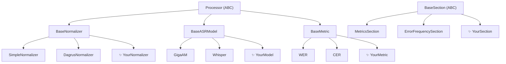

# Extending plantain2asr

plantain2asr is designed to be extended. Every component - models, normalizers, metrics, report sections - is a subclass of a simple abstract base class.

If you are only trying to run comparisons or export research artifacts, stop here and use the `Interactive Constructor` or `Experiment` first. This section is for custom component authors.



---

## The rule: implement the interface, get the pipeline

Every component that subclasses `Processor` automatically works with `>>`:

```python
dataset >> YourNormalizer()   # ✅ works
dataset >> YourModel()        # ✅ works
dataset >> YourMetric()       # ✅ works
```

---

## Four extension points

| What to add | Base class | Guide |
|---|---|---|
| Text normalization rules | `BaseNormalizer` | [Custom Normalizer](custom_normalizer.md) |
| A new ASR model | `BaseASRModel` | [Custom Model](custom_model.md) |
| A new quality metric | `BaseMetric` | [Custom Metric](custom_metric.md) |
| A new report tab | `BaseSection` | [Custom Report Section](custom_section.md) |

!!! tip
    Start with the guide for the component type you need.
    Each guide has a minimal example you can copy and adapt.
