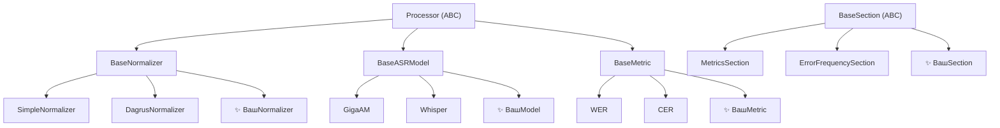

# Расширение plantain2asr

plantain2asr создан для расширения. Каждый компонент - модели, нормализаторы, метрики, вкладки отчёта - это подкласс простого абстрактного базового класса.

Если вам нужно просто сравнить модели или выгрузить исследовательские артефакты, лучше сначала использовать `Интерактивный конструктор` или `Experiment`. Этот раздел нужен тем, кто пишет собственные компоненты.



---

## Правило: реализуй интерфейс — получай пайплайн

Любой компонент, унаследовавшийся от `Processor`, автоматически работает с `>>`:

```python
dataset >> ВашNormalizer()   # ✅ работает
dataset >> ВашModel()        # ✅ работает
dataset >> ВашMetric()       # ✅ работает
```

---

## Четыре точки расширения

| Что добавить | Базовый класс | Руководство |
|---|---|---|
| Правила нормализации текста | `BaseNormalizer` | [Свой нормализатор](custom_normalizer.md) |
| Новая ASR-модель | `BaseASRModel` | [Своя модель](custom_model.md) |
| Новая метрика качества | `BaseMetric` | [Своя метрика](custom_metric.md) |
| Новая вкладка в отчёте | `BaseSection` | [Своя вкладка](custom_section.md) |

!!! tip
    Начните с руководства для нужного типа компонента.
    В каждом руководстве есть минимальный пример, который можно скопировать и адаптировать.
