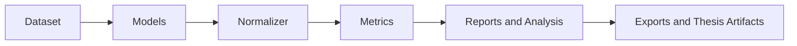

# plantain2asr

**Benchmarking and analysis framework for Russian ASR models.**

The documentation is organized around one simple principle: start with the easiest entry point, then drop to lower-level APIs only when you actually need more control.

## Recommended Entry Path

1. Open the [Interactive Constructor](constructor.md) to assemble a pipeline visually.
2. Use `Experiment` for standard research workflows.
3. Use the `>>` pipeline directly when you need full modular control.

## What plantain2asr gives you

- Local and cloud ASR backends under one interface
- Automatic device choice where supported
- Dataset views instead of in-place mutation
- Built-in normalization, metrics, reports, analysis, and benchmarks
- High-level export scenarios for thesis and appendix artifacts
- Modular architecture for adding your own models, metrics, and report sections

## Fastest Useful Example

```python
from plantain2asr import Experiment, GolosDataset, Models, SimpleNormalizer

dataset = GolosDataset("data/golos")

experiment = Experiment(
    dataset=dataset,
    models=[Models.GigaAM_v3(), Models.Whisper()],
    normalizer=SimpleNormalizer(),
)

experiment.compare_on_corpus(metrics=["WER", "CER", "Accuracy"])
experiment.save_report_html("artifacts/report.html")
```

## Install

=== "Core"
    ```bash
    pip install plantain2asr
    ```
    Includes datasets, normalization, metrics, exports, and reporting.

=== "Common CPU local stack"
    ```bash
    pip install plantain2asr[asr-cpu]
    ```

=== "Common GPU local stack"
    ```bash
    pip install plantain2asr[asr-gpu]
    ```

=== "Per-backend extras"
    ```bash
    pip install plantain2asr[gigaam]
    pip install plantain2asr[whisper]
    pip install plantain2asr[vosk]
    pip install plantain2asr[canary]
    pip install plantain2asr[tone]
    ```

=== "Research analysis"
    ```bash
    pip install plantain2asr[analysis]
    ```

=== "Everything"
    ```bash
    pip install plantain2asr[all]
    ```

Device resolution prefers CUDA, then MPS, then CPU where the backend supports it.

## Mental Model



Each step is still composable as a pipeline. `Experiment` simply orchestrates the same building blocks for common research scenarios.

## Supported model families

| Family | Typical call | Extra | Device |
|---|---|---|---|
| GigaAM v3 | `Models.GigaAM_v3()` | `gigaam` | CUDA / MPS / CPU |
| GigaAM v2 | `Models.GigaAM_v2()` | `gigaam` | CUDA / MPS / CPU |
| Whisper | `Models.Whisper()` | `whisper` | CUDA / MPS / CPU |
| T-one | `Models.Tone()` | `tone` | CUDA / CPU |
| Vosk | `Models.Vosk(...)` | `vosk` | CPU |
| Canary | `Models.Canary()` | `canary` | CUDA |
| SaluteSpeech | `Models.SaluteSpeech()` | none | cloud |

## If you are new

- Go to [Interactive Constructor](constructor.md) if you want to assemble a chain and immediately see code.
- Go to [Quick Start](quickstart.md) if you want a canonical runnable workflow.
- Go to [API Reference](api/dataloaders.md) if you already know what building block you need.
- Go to [Extending](extending/index.md) if you want to add your own components.
