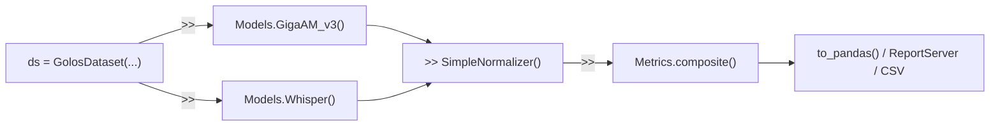

# plantain2asr

**Benchmarking and analysis framework for Russian ASR models.**

plantain2asr is built around the `>>` pipeline operator: you load a dataset, push it through models,
normalizers, and metrics -- each step produces a new view, nothing is mutated in place.

## The `>>` interface

```python
from plantain2asr import GolosDataset, Models, SimpleNormalizer, Metrics

ds = GolosDataset("data/golos")

ds >> Models.GigaAM_v3()      # run inference, results are cached
ds >> Models.Whisper()         # run another model on the same data

norm = ds >> SimpleNormalizer()  # normalize references and hypotheses
norm >> Metrics.composite()      # compute WER, CER, MER, Accuracy, ...

df = norm.to_pandas()
print(df.groupby("model")[["WER", "CER"]].mean().sort_values("WER"))
```

Each `>>` step returns the dataset with new results layered on top.
You can branch, filter, and recombine at any point.

## What plantain2asr gives you

- The `>>` pipeline: dataset >> model >> normalizer >> metric >> report
- Local and cloud ASR backends under one interface
- Automatic device choice (CUDA / MPS / CPU) where supported
- Immutable dataset views instead of in-place mutation
- Built-in normalization, metrics, reports, analysis, and benchmarks
- `Experiment` convenience wrapper for common research scenarios
- Modular architecture for adding your own models, metrics, and report sections

## Install

=== "Core"
    ```bash
    pip install plantain2asr
    ```
    Includes datasets, normalization, metrics, exports, and reporting.

=== "Common CPU local stack"
    ```bash
    pip install plantain2asr[asr-cpu]
    ```

=== "Common GPU local stack"
    ```bash
    pip install plantain2asr[asr-gpu]
    ```

=== "Per-backend extras"
    ```bash
    pip install plantain2asr[gigaam]
    pip install plantain2asr[whisper]
    pip install plantain2asr[vosk]
    pip install plantain2asr[canary]
    pip install plantain2asr[tone]
    ```

=== "Research analysis"
    ```bash
    pip install plantain2asr[analysis]
    ```

=== "Everything"
    ```bash
    pip install plantain2asr[all]
    ```

Device resolution prefers CUDA, then MPS, then CPU where the backend supports it.

## Mental Model



Every block is a `>>` step. Compose them however you need.

## Supported model families

| Family | Typical call | Extra | Device |
|---|---|---|---|
| GigaAM v3 | `Models.GigaAM_v3()` | `gigaam` | CUDA / MPS / CPU |
| GigaAM v2 | `Models.GigaAM_v2()` | `gigaam` | CUDA / MPS / CPU |
| Whisper | `Models.Whisper()` | `whisper` | CUDA / MPS / CPU |
| T-one | `Models.Tone()` | `tone` | CUDA / CPU |
| Vosk | `Models.Vosk(...)` | `vosk` | CPU |
| Canary | `Models.Canary()` | `canary` | CUDA |
| SaluteSpeech | `Models.SaluteSpeech()` | none | cloud |

## If you are new

- Go to [Interactive Constructor](constructor.md) to assemble a `>>` chain and see code.
- Go to [Quick Start](quickstart.md) for a full pipeline walkthrough.
- Go to [API Reference](api/dataloaders.md) if you already know what building block you need.
- Go to [Extending](extending/index.md) if you want to add your own components.
