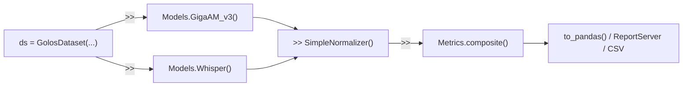

# plantain2asr

**Фреймворк для бенчмаркинга и анализа русскоязычных ASR-моделей.**

plantain2asr построен вокруг оператора `>>`: вы загружаете датасет и прогоняете его через модели,
нормализаторы и метрики -- каждый шаг создаёт новое представление, ничего не мутируется.

## Интерфейс `>>`

```python
from plantain2asr import GolosDataset, Models, SimpleNormalizer, Metrics

ds = GolosDataset("data/golos")

ds >> Models.GigaAM_v3()      # запустить инференс, результаты кешируются
ds >> Models.Whisper()         # запустить ещё одну модель на тех же данных

norm = ds >> SimpleNormalizer()  # нормализовать эталоны и гипотезы
norm >> Metrics.composite()      # посчитать WER, CER, MER, Accuracy, ...

df = norm.to_pandas()
print(df.groupby("model")[["WER", "CER"]].mean().sort_values("WER"))
```

Каждый `>>` возвращает датасет с новым слоем результатов.
Можно ветвить, фильтровать и рекомбинировать в любой точке.

## Что даёт plantain2asr

- Пайплайн `>>`: dataset >> model >> normalizer >> metric >> report
- Локальные и облачные ASR-модели под единым интерфейсом
- Автоматический выбор устройства (CUDA / MPS / CPU) там, где это поддерживается
- Иммутабельные представления датасета вместо мутаций "на месте"
- Встроенные нормализаторы, метрики, отчёты, анализ и бенчмарки
- Обёртка `Experiment` для типовых исследовательских сценариев
- Модульную архитектуру для своих моделей, метрик и вкладок отчёта

## Установка

=== "Ядро"
    ```bash
    pip install plantain2asr
    ```
    Включает датасеты, нормализацию, метрики, экспорты и отчёты.

=== "Типовой локальный CPU-стек"
    ```bash
    pip install plantain2asr[asr-cpu]
    ```

=== "Типовой локальный GPU-стек"
    ```bash
    pip install plantain2asr[asr-gpu]
    ```

=== "Extras по backend-ам"
    ```bash
    pip install plantain2asr[gigaam]
    pip install plantain2asr[whisper]
    pip install plantain2asr[vosk]
    pip install plantain2asr[canary]
    pip install plantain2asr[tone]
    pip install "tone @ https://github.com/voicekit-team/T-one/archive/3c5b6c015038173840e62cea99e10cdb1c759116.tar.gz"
    ```

=== "Исследовательский анализ"
    ```bash
    pip install plantain2asr[analysis]
    ```

=== "Всё сразу"
    ```bash
    pip install plantain2asr[all]
    ```

Логика выбора устройства: сначала CUDA, затем MPS, затем CPU, если backend это поддерживает.

## Ментальная модель



Каждый блок -- шаг `>>`. Компонуйте как нужно.

## Поддерживаемые семейства моделей

| Семейство | Типичный вызов | Extra | Устройство |
|---|---|---|---|
| GigaAM v3 | `Models.GigaAM_v3()` | `gigaam` | CUDA / MPS / CPU |
| GigaAM v2 | `Models.GigaAM_v2()` | `gigaam` | CUDA / MPS / CPU |
| Whisper | `Models.Whisper()` | `whisper` | CUDA / MPS / CPU |
| T-one | `Models.Tone()` | `tone` + source archive T-One | CUDA / CPU |
| Vosk | `Models.Vosk(...)` | `vosk` | CPU |
| Canary | `Models.Canary()` | `canary` | CUDA |
| SaluteSpeech | `Models.SaluteSpeech()` | none | облако |

## Если вы заходите впервые

- Идите в [Интерактивный конструктор](constructor.md), чтобы собрать цепочку `>>` и сразу увидеть код.
- Идите в [Быстрый старт](quickstart.md) для полного пошагового примера.
- Идите в [Справочник API](api/dataloaders.md), если вы уже знаете, какой блок вам нужен.
- Идите в [Расширение](extending/index.md), если хотите добавить свои компоненты.
